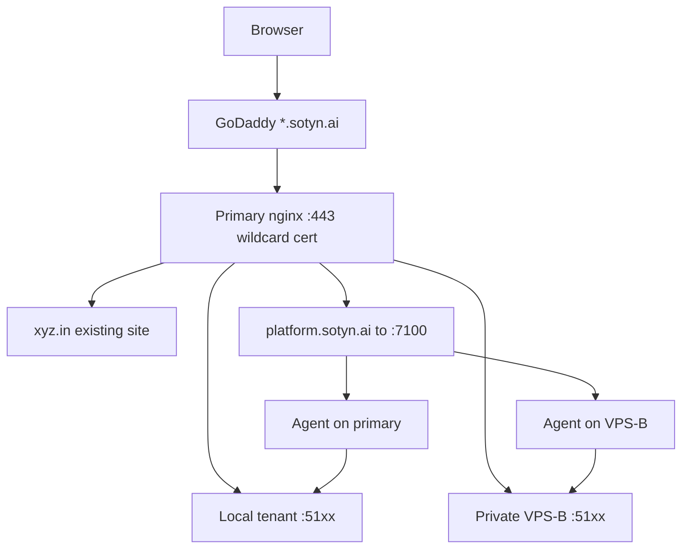

# Wildcard SaaS Gateway vs SEPL (companion note)

Source: operator plan / companion verdict (Aug 2026). External design brief: *Wildcard SaaS Gateway Architecture* (dynamic `*.abc.ai` gateway). This note maps that brief onto SEPL/Sotyn as built so far.

**Status:** architecture note — gateway agent **v1 scaffolded** (`platform/gateway-agent/`, Compose profile `gateway`). See [GATEWAY-agent-plan.md](./GATEWAY-agent-plan.md). Edge still needs real DNS + primary LE smoke on a VPS.

## Verdict

**Doable and better as the public edge.** Treat the gateway brief as the **routing/SSL layer** on top of what this repo already owns. Do **not** redesign platform, agent, or tenant Docker.

**Locked for build (Aug 2026):** one **gateway agent** on primary; **HTTP-01** Certbot (no GoDaddy API required for v1); optional Compose `gateway-nginx`; works dedicated Sotyn VPS **or** path-scoped on shared host nginx.

| Layer | SEPL today / planned | Gateway brief |
| --- | --- | --- |
| Control plane | Platform `:7100` + Hosts + JWT | Assumes it exists (“platform knows tenant→VPS→port”) |
| Worker | Agent + Docker + `TENANTS_ROOT` | Unchanged (“do not redesign tenant deployment”) |
| Public HTTPS | Not built (PHASE4 edge step) | **Primary VPS nginx + one `*.` Let’s Encrypt** |
| Multi-VPS URL | Earlier talk: per-slug DNS | **One DNS `*` → primary; nginx proxies to private backends** |
| Proxy | Caddy debated then dropped | **No Caddy** — matches locked hybrid (host nginx SSL) |

Map names: brief `abc.ai` / `*.abc.ai` ↔ `sotyn.ai` / `*.sotyn.ai`; brief `xyz.in` ↔ keep current VPS site; apex marketing (if any) stays off this VPS (same idea as leaving Vercel apex untouched).

## Why this is better than earlier drift

1. **One public `:443` owner** — host nginx (already serves `xyz.in`). No Caddy fight.
2. **One free wildcard cert** — Certbot DNS-01 + GoDaddy API for `*.sotyn.ai` (sotyn is on GoDaddy, not Cloudflare).
3. **No per-tenant DNS** — only `*.sotyn.ai → PRIMARY_IP`. Multi-VPS still works because primary proxies to private IPs.
4. **Fits PHASE4 already** — docs already say the worker side owns “nginx map + reload”; agent stub still says entitlements / nginx later. The brief is that missing piece, with an explicit **primary-only** gateway (workers stay private).

Compose for platform + agent ([platform/docker-compose.yml](../platform/docker-compose.yml)) stays valid **behind** this nginx; it does not replace the gateway.

## What SEPL already covers (leave alone)

- Tenant → host → container/port (platform DB + Hosts UI + agent provision)
- Docker image deploy / logs / backups
- `AGENT_TOKEN` / multi-host registration

## What the gateway adds (new, minimum)

1. **GoDaddy DNS:** `A`/`AAAA` `*` → primary VPS public IP only (apex `sotyn.ai` untouched if used elsewhere).
2. **Certs v1:** Certbot **HTTP-01** per hostname via gateway agent (wildcard DNS-01 + GoDaddy API optional later).
3. **Nginx on primary:** keep `xyz.in` if co-located; Sotyn fragments only under `sotyn.d/` (or dedicated VPS nginx in Compose).
4. **Gateway agent (coded):** on provision, platform may call route sync + cert ensure; `nginx -t` / reload. Primary only.
5. **Private path to VPS-B+:** VPN/Tailscale/WireGuard (or provider private LAN); do not expose worker `:51xx` / agent `:7200` on the public internet.

## Concrete fit / small gaps in this repo

- Hostname product choice: brief uses `tenant.abc.ai`; PHASE4 text still mentions `{slug}-erp…`. Later product call was `*.sotyn.ai` — **align nginx map to bare subdomain**, drop `-erp` in new routes.
- Agent today is **per-worker Docker**; it does **not** yet write nginx. Gateway writer should use platform registry (host + published port) and run (or be called) on primary.
- Remote upstreams need platform to store **reachable private host IP + port** (or equivalent), not only localhost ports.

## Follow-ups (when hardening edge)

- VPS smoke: real HTTP-01 + DNS `*.sotyn.ai`.
- Optional later: Certbot DNS-01 GoDaddy for one `*.sotyn.ai` wildcard (fewer per-tenant waits).
- Private network for VPS-B+ upstreams; keep agent/tenant ports off the public internet.
- Hostname delete → gateway route delete on destroy (when platform destroy API exists).

## Recommendation

Adopt the gateway brief as the **official edge companion** to SEPL:

- Keep building platform + agent + tenant containers.
- Edge build path: **gateway agent + HTTP-01** (Compose profile or host nginx include), not Caddy and not per-slug public DNS.

No blocker in the existing system; the brief constraints match VPS facts (`xyz.in` + GoDaddy sotyn + multi-VPS agents).

## Related

- [GATEWAY-agent-plan.md](./GATEWAY-agent-plan.md)
- [PHASE4-tenant-model.md](./PHASE4-tenant-model.md)
- [PLATFORM-VPS-deploy.md](./PLATFORM-VPS-deploy.md)
- [multitenancy/README.md](./multitenancy/README.md)
- Platform UI: Docs → Gateway / Docker / Env / Multi‑VPS
