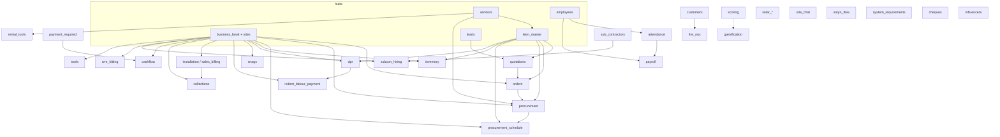

# Module dependency graph (for `dependsOn` / kill-switches)

> Status: **traced Aug 2026** from current SEPL routes + schema usage. Design-only — not wired into `KILLABLE_MODULES` yet.  
> Purpose: when expanding org-level feature packs, refuse enabling a module whose hard deps are off, and cascade-disable dependents when a hub is killed.

**How to read**

| Strength | Meaning for kill-switch |
|---|---|
| **hard** | SQL JOIN / FK / write into another module’s tables — broken or empty core flows if dep is off |
| **soft** | Client lookup / name match / denormalized text — UX degrades; save still works |
| **overlay** | Reads many modules for scoring/dashboards/AI — must skip missing packs, never block kill |

`users` / roles / auth are **always-on platform** — omitted from product `dependsOn` lists (every module soft-depends on them).

---

## Hub ranking (most dependents first)

| Hub | Role | Hard dependents (high) |
|---|---|---|
| **business_book** (+ **sites**) | Project spine | orders, procurement, procurement_schedule, dpr, snags, inventory, tools, sales_billing, collections, cashflow, crm_kitting, subcon_hiring, indent_labour_payment |
| **item_master** | Catalog / rates | quotations, orders, procurement, procurement_schedule, inventory, dpr (store/PO items) |
| **vendors** | Supplier master | item_master (vendor_id), procurement, rental_tools, ar_ap_tracker; soft → payment_required |
| **employees** | People master | attendance, payroll; soft → payment_required, dpr staff-cost |
| **leads** / funnels | Quote origin | quotations (JOIN / company match); orders (`lead_id`) |
| **quotations** | Commercial doc | orders (`quotation_id`); blocked delete if POs reference |
| **customers** | Soft CRM hub | fire_noc (JOIN); naming elsewhere |

**Clean islands (almost no hub deps):** `solar_quotation`, `site_chat`, `sotyn_flow`, `system_requirements`, `cheques`, `influencers`.

---

## Machine-oriented registry (proposed `dependsOn`)

Direction: **module → prerequisites** (must be on before this pack can be on).

```js
// Strength: 'hard' | 'soft' | 'overlay'
// Pack keys align with sidebar / future KILLABLE_MODULES — not every RBAC leaf.

const MODULE_DEPS = {
  // ── Already killable ──────────────────────────────────────────
  site_chat:            { dependsOn: [], strength: {} },
  sotyn_flow:           { dependsOn: [], strength: {} },
  system_requirements:  { dependsOn: [], strength: {} },

  // ── Isolated / easy next kills ────────────────────────────────
  solar:                { dependsOn: [], note: 'RBAC key solar_quotation; own solar_* tables' },
  cheques:              { dependsOn: [] },
  influencers:          { dependsOn: [] },
  fire_noc:             { dependsOn: ['customers'], strength: { customers: 'hard' } },
  help_tickets:         { dependsOn: [] },
  complaints:           { dependsOn: [] },
  ai_agent:             { dependsOn: [], strength: {}, note: 'overlay SELECT across many tables — skip missing' },
  ai_quotation:         { dependsOn: ['item_master'], strength: { item_master: 'soft' } },
  gamification:         { dependsOn: ['scoring'], strength: { scoring: 'hard' } },
  delegations:          { dependsOn: [] },
  pms_tasks:            { dependsOn: [] },
  checklists:           { dependsOn: [] },
  company_assets:       { dependsOn: [] },
  rentals:              { dependsOn: [] },
  rental_tools:         { dependsOn: ['vendors'], strength: { vendors: 'hard' } },
  tools:                { dependsOn: ['business_book'], strength: { business_book: 'hard' }, note: 'via sites.current_site_id' },

  // ── CRM pack ──────────────────────────────────────────────────
  crm_funnel:           { dependsOn: [] },
  leads:                { dependsOn: [] },           // sales_funnel
  customers:            { dependsOn: [] },           // hub
  business_book:        { dependsOn: [], note: 'HUB — creates sites + order_planning on write' },
  crm_kitting:          { dependsOn: ['business_book'], strength: { business_book: 'hard' } },

  // ── Quotes ────────────────────────────────────────────────────
  labour_rates:         { dependsOn: [] },
  quotations: {
    dependsOn: ['leads', 'item_master', 'labour_rates'],
    strength: { leads: 'hard', item_master: 'hard', labour_rates: 'soft' },
    softAlso: ['crm_funnel'], // company-name match for BOQ links
  },

  // ── Masters used as hubs ──────────────────────────────────────
  vendors:              { dependsOn: [] },
  item_master:          { dependsOn: ['vendors'], strength: { vendors: 'hard' } },
  employees:            { dependsOn: [] },

  // ── Orders / procurement chain ────────────────────────────────
  orders: {
    dependsOn: ['business_book', 'item_master', 'leads', 'quotations'],
    strength: {
      business_book: 'hard', item_master: 'hard',
      leads: 'soft', quotations: 'soft', // FKs nullable in practice but JOINed heavily
    },
  },
  procurement: {
    dependsOn: ['business_book', 'item_master', 'vendors', 'orders'],
    strength: {
      business_book: 'hard', item_master: 'hard', vendors: 'hard', orders: 'hard',
    },
    softAlso: ['employees', 'inventory'], // client dropdowns / warehouses
  },
  procurement_schedule: {
    dependsOn: ['business_book', 'item_master', 'procurement'],
    strength: { business_book: 'hard', item_master: 'hard', procurement: 'hard' },
  },
  inventory: {
    dependsOn: ['item_master', 'business_book'],
    strength: { item_master: 'hard', business_book: 'hard' }, // sites
  },

  // ── Projects ──────────────────────────────────────────────────
  dpr: {
    dependsOn: ['business_book', 'item_master'],
    strength: { business_book: 'hard', item_master: 'hard' },
    softAlso: ['attendance', 'employees', 'procurement', 'inventory', 'sub_contractors', 'indent_labour_payment'],
  },
  snags:                { dependsOn: ['business_book'], strength: { business_book: 'hard' } },
  indent_labour_payment: {
    dependsOn: ['dpr', 'business_book'],
    strength: { dpr: 'hard', business_book: 'hard' },
    softAlso: ['sub_contractors'],
  },
  installation: { // sales billing UI
    dependsOn: ['business_book', 'dpr', 'procurement'],
    strength: { business_book: 'hard', dpr: 'soft', procurement: 'soft' },
    note: 'reads DPR + DN→indent; writes receivables on paid',
  },

  // ── Finance ───────────────────────────────────────────────────
  payment_required: {
    dependsOn: ['cashflow'],
    strength: { cashflow: 'hard' }, // writes cash_flow_entries on payout
    softAlso: ['vendors', 'employees', 'business_book', 'dpr'],
  },
  collections: {
    dependsOn: ['business_book'],
    strength: { business_book: 'hard' },
    softAlso: ['installation'], // receivables often created from billing paid
  },
  cashflow: {
    dependsOn: ['business_book'],
    strength: { business_book: 'hard' },
    softAlso: ['payment_required', 'procurement'],
  },
  ar_ap_tracker: {
    dependsOn: ['business_book', 'vendors'],
    strength: { business_book: 'hard', vendors: 'soft' },
  },
  billing: {
    dependsOn: ['installation'],
    strength: { installation: 'soft' },
    note: 'invoice surface; couple with installation pack in product plans',
  },

  // ── HRMS chain ────────────────────────────────────────────────
  attendance: {
    dependsOn: ['employees'],
    strength: { employees: 'hard' },
    softAlso: ['payroll'], // reads payroll_settings
  },
  payroll: {
    dependsOn: ['employees', 'attendance'],
    strength: { employees: 'hard', attendance: 'hard' },
  },
  hr:                   { dependsOn: ['employees'], strength: { employees: 'soft' } },
  hr_system:            { dependsOn: ['employees'], strength: { employees: 'soft' } },
  sub_contractors:      { dependsOn: [] },
  subcon_hiring: {
    dependsOn: ['business_book', 'sub_contractors'],
    strength: { business_book: 'hard', sub_contractors: 'hard' },
  },

  // ── Overlays (never hard-block product kills) ─────────────────
  // Dashboard / DPR / CMD / scoring / AI: composite surfaces.
  // Entitlement hide/disable is best-effort: nav hide + pack front-door
  // gates; overlay sections skip/empty when a source pack is OFF.
  // dependsOn does NOT mean “Dashboard may not boot.” See PHASE4
  // § Entitlement API + hide/disable semantics.
  scoring: {
    dependsOn: [],
    strength: {},
    overlayReads: [
      'business_book', 'dpr', 'procurement', 'quotations', 'leads',
      'installation', 'delegations', 'pms_tasks', 'checklists',
      'help_tickets', 'employees', 'customers', 'vendors', 'payment_required',
    ],
  },
  // RACI MODULE_DEFS slices — same rule: empty board if pack off
  raci: {
    dependsOn: [],
    overlayReads: [
      'payment_required', 'crm_funnel', 'leads', 'solar', 'quotations',
      'procurement', 'cheques', 'subcon_hiring', 'dpr', 'installation', 'collections',
    ],
  },
};
```

---

## Graph (hard edges only)



---

## Evidence index (file pointers)

| Edge | Evidence |
|---|---|
| business_book → sites / order_planning | `server/routes/businessbook.js` create/delete cascades |
| orders ⨝ BB, sites, leads, quotations | `server/routes/orders.js` list JOINs |
| procurement ⨝ BB, sites, items, vendors | `server/routes/procurement.js`; client also `/item-master`, `/hr/employees`, `/inventory` |
| quotations ⨝ leads + item_master + labour | `server/routes/quotations.js` |
| dpr ⨝ sites→BB, item_master, attendance | `server/routes/dpr.js` |
| sales_billing → receivables | `server/routes/salesBilling.js` on paid |
| payment_required → cash_flow_entries | `server/routes/paymentrequired.js` payout |
| payroll ← employees + attendance | `server/routes/payroll.js` |
| item_master ⨝ vendors | `server/routes/itemmaster.js` |
| fire_noc ⨝ customers | `server/routes/fireNoc.js` |
| crm_kitting ← BB company_name | `server/routes/crmKitting.js` |
| solar isolated | `server/routes/solar.js` — only `solar_*` tables |
| site_chat / sotyn_flow | own DBs; names from `users` only |
| scoring / RACI overlays | `server/routes/scoring.js`, `server/utils/raciModules.js` |
| gamification → scoring | `server/routes/champions.js` requires scoring |

---

## Kill-order heuristics (later)

1. Never kill a hub while any **hard** dependent is still entitled.  
2. Or: killing a hub **cascades off** all hard dependents (stricter, clearer for SaaS plans).  
3. Overlays always stay on; they no-op empty slices.  
4. Prefer **pack** entitlements (`solar`, `crm_extra`, `procurement`, `finance`, `hrms`, `projects`, …) over 50 leaf RBAC keys — leaves stay for tenant Roles UI.

### Common vs optional (all tenants) — Aug 2026

See also [PHASE4-tenant-model.md](../PHASE4-tenant-model.md) § *Common modules for all tenants* and *Golden asks*.

| Layer | Keys / surfaces | Entitlement? |
|---|---|---|
| **Chassis** | users, roles, dashboard, backups, audit, settings | Always on — every tenant (ERP or feature-only) |
| **ERP baseline** | employees, customers, vendors, business_book, item_master | Default ON for **ERP-class** plans only |
| **Optional packs** | solar, collab, crm_extra, procurement, projects, finance, hrms, ops_extra | Super-admin / plan — **only** layer for feature-only orgs (e.g. barber salon + Chat) |

```text
ERP tenant     = chassis + ERP baseline + sold packs
Feature-only   = chassis + sold packs only
```

### Suggested product packs → leaf keys

| Pack | Includes (RBAC / surfaces) | Pack-level dependsOn |
|---|---|---|
| *(chassis)* | users, roles, dashboard, backups, audit | — always on |
| *(ERP baseline)* | employees, customers, vendors, business_book, item_master | — ERP-class plans only |
| `solar` | solar_quotation family | [] |
| `collab` | site_chat, sotyn_flow | [] |
| `crm_extra` | leads, crm_funnel, influencers, quotations, labour_rates, crm_kitting | ERP baseline (BB, items) |
| `procurement` | orders, procurement, procurement_schedule, inventory | ERP baseline (BB, items, vendors) |
| `projects` | dpr, snags, indent_labour_payment, installation | ERP baseline; procurement soft |
| `finance` | payment_required, collections, cashflow, ar_ap, cheques, billing | ERP baseline; cashflow↔payables |
| `hrms` | attendance, payroll, hr, hr_system, sub_contractors, subcon_hiring, scoring, gamification | employees if baseline on; BB for subcon_hiring |
| `ops_extra` | tools, rentals, rental_tools, company_assets, fire_noc, complaints, help_tickets, tasks, ai_* | see leaf graph |

**Exceptions:** solar-only ERP SKU may omit `business_book`. Feature-only SKU (barber chain + Chat) omits the whole ERP baseline.

---

## Explicit non-goals of this doc

- Not implementing `dependsOn` in `features.js` yet  
- Not claiming every soft client `api.get` is listed — **hard SQL/FK edges are the contract**  
- Not splitting code into packages — graph is for entitlement logic only  
- Not requiring Dashboard / DPR / other overlays to hard-fail when an upstream pack is OFF — those degrade (best effort); see `PHASE4-tenant-model.md` § Entitlement API + hide/disable semantics  
- Not using this graph to invent per-tenant Dashboard / DPR forks
